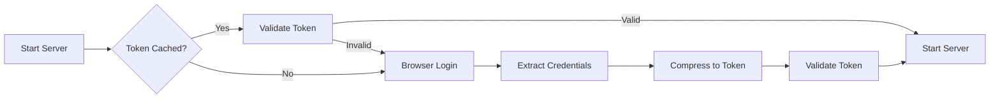

# Qwen API Authentication Guide

## Overview

The Qwen API uses **browser-based authentication** to obtain valid Bearer tokens from chat.qwen.ai. This ensures secure, legitimate access to Qwen's services.

## Authentication Flow



## Quick Start

### Method 1: Environment Variables (Recommended)

```bash
# Set your Qwen credentials
export QWEN_EMAIL='your@email.com'
export QWEN_PASSWORD='your_password'

# Start the server
python main.py
```

### Method 2: Command-Line Arguments

```bash
python main.py --qwen-email your@email.com --qwen-password your_password
```

### Method 3: Docker

```bash
docker run -e QWEN_EMAIL='your@email.com' -e QWEN_PASSWORD='your_password' -p 8080:8080 qwen-api
```

## How It Works

### 1. Browser Automation

The system uses **Playwright** to automate login to `https://chat.qwen.ai/auth?action=signin`:

- Opens a headless browser
- Navigates to login page
- Fills email and password
- Submits login form
- Waits for authentication to complete

### 2. Credential Extraction

After successful login, the system extracts:

- **localStorage**: Application state and session data
- **Cookies**: HTTP session cookies

### 3. Token Compression

Credentials are compressed into a Bearer token:

```python
credentials = {
    "localStorage": {...},
    "cookies": [...]
}
# JSON → gzip → base64
token = base64.b64encode(gzip.compress(json.dumps(credentials)))
```

### 4. Token Validation

The token is validated with Qwen's API:

```bash
curl -X POST https://qwen.aikit.club/validate \
  -H "Content-Type: application/json" \
  -d '{"token": "YOUR_TOKEN_HERE"}'
```

### 5. Token Caching

Valid tokens are cached in `.sessions/qwen_token_cache.json` for reuse across restarts.

## Configuration Options

| Option | Environment Variable | CLI Argument | Default | Description |
|--------|---------------------|--------------|---------|-------------|
| Email | `QWEN_EMAIL` | `--qwen-email` | - | Qwen account email (required) |
| Password | `QWEN_PASSWORD` | `--qwen-password` | - | Qwen account password (required) |
| Force Re-auth | `FORCE_REAUTH` | `--force-reauth` | `false` | Force new login even if cached token exists |
| Headless Browser | `HEADLESS_BROWSER` | - | `true` | Run browser in headless mode |

## Token Management

### View Cached Token

```bash
cat .sessions/qwen_token_cache.json
```

### Validate Token Manually

```bash
python -m app.auth.token_manager validate YOUR_TOKEN_HERE
```

### Force Token Refresh

```bash
python main.py --force-reauth
```

### Clear Token Cache

```bash
rm .sessions/qwen_token_cache.json
```

## Troubleshooting

### Problem: "Login failed - still on login page"

**Solutions:**
1. Verify your email and password are correct
2. Check if Qwen website structure has changed
3. Try with `HEADLESS_BROWSER=false` to see the browser
4. Check for CAPTCHA requirements

### Problem: "Token validation failed"

**Solutions:**
1. Token may have expired - use `--force-reauth`
2. Network issues with validation endpoint
3. Token compression/decompression error

### Problem: "No cached session found"

**Solutions:**
1. This is normal on first run
2. System will automatically perform browser login
3. Ensure email and password are provided

### Problem: "Browser automation failed"

**Solutions:**
1. Install Playwright browsers: `playwright install chromium`
2. Check system dependencies for headless browser
3. Try with headless mode disabled for debugging

## Security Considerations

### Token Storage

- Tokens are stored in `.sessions/` directory
- File permissions: `600` (owner read/write only)
- **Never commit `.sessions/` to version control**
- Add to `.gitignore`:
  ```
  .sessions/
  *.token
  ```

### Credential Handling

- Environment variables are safer than CLI arguments
- Use `.env` file for local development:
  ```bash
  # .env
  QWEN_EMAIL=your@email.com
  QWEN_PASSWORD=your_password
  ```
- Load with: `export $(cat .env | xargs)`

### Token Expiration

- Tokens typically valid for 7-30 days
- System automatically detects expiration
- Triggers re-authentication when needed

## Advanced Usage

### Programmatic Token Management

```python
from app.auth.token_manager import get_or_create_token

# Get valid token (uses cache or creates new)
token = await get_or_create_token(
    email="your@email.com",
    password="your_password"
)

# Force new token
token = await get_or_create_token(
    email="your@email.com",
    password="your_password",
    force_new=True
)
```

### Manual Browser Authentication

```python
from app.auth.browser_auth import authenticate_with_browser

# Authenticate and extract credentials
local_storage, cookies = await authenticate_with_browser(
    email="your@email.com",
    password="your_password",
    headless=False  # Show browser for debugging
)
```

### Custom Token Compression

```python
from app.auth.token_manager import QwenTokenManager

manager = QwenTokenManager()

# Compress credentials
token = manager.compress_credentials(local_storage, cookies)

# Decompress token
credentials = manager.decompress_token(token)
```

## API Reference

### Browser Authentication

**Module:** `app.auth.browser_auth`

```python
async def authenticate_with_browser(
    email: str,
    password: str,
    headless: bool = True,
    force_new: bool = False
) -> Tuple[Dict[str, str], list]:
    """
    Authenticate via browser and extract credentials
    
    Args:
        email: Qwen account email
        password: Qwen account password
        headless: Run browser in headless mode
        force_new: Force new login
        
    Returns:
        (localStorage_dict, cookies_list)
    """
```

### Token Management

**Module:** `app.auth.token_manager`

```python
async def get_or_create_token(
    email: Optional[str] = None,
    password: Optional[str] = None,
    force_new: bool = False
) -> str:
    """
    Get valid token, creating new one if needed
    
    Args:
        email: User email
        password: User password
        force_new: Force new token creation
        
    Returns:
        Valid Bearer token
    """
```

## Testing

### Test Browser Authentication

```bash
python -m app.auth.browser_auth your@email.com your_password
```

### Test Token Creation

```bash
python -m app.auth.token_manager create your@email.com your_password
```

### Test Token Validation

```bash
python -m app.auth.token_manager validate YOUR_TOKEN_HERE
```

### Test Token Decompression

```bash
python -m app.auth.token_manager decompress YOUR_TOKEN_HERE
```

## FAQ

**Q: Do I need to provide credentials every time?**  
A: No, tokens are cached. You only need credentials on first run or when token expires.

**Q: How long are tokens valid?**  
A: Typically 7-30 days, depending on Qwen's session policy.

**Q: Can I use the same token across multiple instances?**  
A: Yes, copy `.sessions/qwen_token_cache.json` to other instances.

**Q: Is my password stored anywhere?**  
A: No, passwords are only used during authentication. Only the resulting token is cached.

**Q: What if Qwen's login page changes?**  
A: The selectors in `browser_auth.py` may need updating. File an issue if this happens.

**Q: Can I disable authentication for testing?**  
A: No, authentication is mandatory. Qwen API requires valid credentials.

## Support

For issues, questions, or contributions:

- **GitHub Issues**: https://github.com/Zeeeepa/qwen-api/issues
- **Documentation**: https://github.com/Zeeeepa/qwen-api
- **Discord**: [Join our community]

---

**Last Updated:** 2025-01-07  
**Version:** 0.2.0

